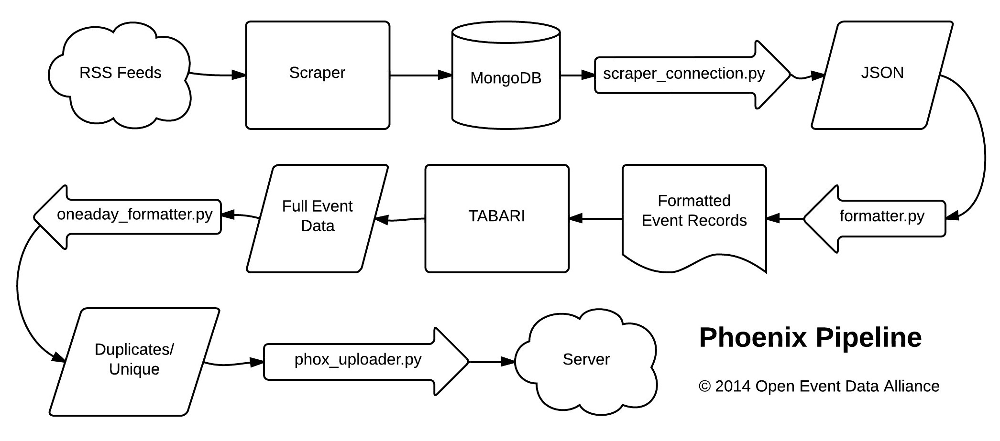

.. Phoenix Pipeline documentation master file, created by
   sphinx-quickstart on Thu Apr 17 17:07:15 2014.
   You can adapt this file completely to your liking, but it should at least
   contain the root `toctree` directive.

Introduction
============
Turning news into events since 2014.

Welcome to the documentation for the Phoenix (PHOX) Pipeline! The PHOX pipeline is a system that links a series of Python programs to convert files from a whitelist of RSS feeds into event data and uploads the data into a designated server. This reference provides a description of how the pipeline works and what it does. It is also written as a programming reference including necessary details on packages, modules, and classes needed to contribute to the codebase.

Contents:
.. toctree::
   :maxdepth: 2

   pipeline

How it Works
============
The PHOX pipeline links a series of Python programs to convert files scrapped from a whitelist of RSS feeds to machine-coded event data using the TABARI. The event data is then uploaded to a server designated in a config file. The system is designed to process a single days worth of information that can be included in multiple text files. Below is a flowchart of the pipeline:

It is now possible to code event data from a limited list of sources that is
different from that used within the web scraper. For instance, it might be
desirable to scrape content from a wide variety of sources, but some of this
content may be too noisy to include in an event dataset or there is some
experementation necessary to determine which sources to include in a final
dataset. The data sources are restricted using the ``source_keys.txt`` file.
These keys correspond to those found in the ``source`` field within the MongoDB
instance created by the `web scraper <https://github.com/openeventdata/scraper>`_.

Source code can be found at: https://github.com/openeventdata/phoenix_pipeline

This software is MIT Licensed (MIT)
Copyright (c) 2014 Open Event Data Alliance

Configuration file
==================
PHOX_config.ini configures the initial settings for PHOX pipeline and should be included in the working directory.

::

    [Server]
    server_name = <server name for http: site>
    username =  <user name for ftp login to server_name>
    password =  <user password for ftp login to server_name>
    server_dir = <path to directory on the server where subdirectories are located>

    [Pipeline]
    scraper_stem =  <stem for scrapped output>
    recordfile_stem =  <stem for output of monger_formatter.py>
    fullfile_stem =  <stem for output of TABARI.0.8.4b1>
    eventfile_stem =  <stem for event output of oneaday_formatter.py>
    dupfile_stem =  <stem for duplicate file output of oneaday_formatter.py>
    outputfile_stem =  <stem for files uploaded by phox_uploader.py>

Example of PHOX_config.ini
    
::

    [Server]
    server_name = openeventdata.org
    username = myusername
    password = myweakpassword12345
    server_dir = public_html/datasets/phoenix/

    [Pipeline]
    scraper_stem = scraper_results_20
    recordfile_stem = eventrecords.
    fullfile_stem = events.full.
    eventfile_stem = Phoenix.events.
    dupfile_stem = Phoenix.dupindex.
    outputfile_stem = Phoenix.events.20

TABARI.0.8.4b2
========================
TABARI (Text Analysis By Augmented Replacement Instructions) is an event coding program used to machine code even data from formatted source texts in the pipeline. It is dictionary-based and relies on sparse parsing and pattern recognition to identify 'who-did-what-to-whom' relations. 

For details see: http://eventdata.parusanalytics.com/software.dir/tabari.html

Phoenix Pipeline Package
========================

:mod:`scraper_connection` Module
--------------------------------
Downloads scraped stories from Mongo DB.
                
.. automodule:: scraper_connection
    :members:
    :undoc-members:
    :show-inheritance:

:mod:`formatter` Module
-----------------------
Parses scraped stories from a Mongo DB into TABARI-formatted source text input.

.. automodule:: formatter
    :members:
    :undoc-members:
    :show-inheritance:
        
:mod:`oneaday_formatter` Module
-------------------------------
Deduplication. Reads in a single day of coded event data, selects first record of souce-target-event combination and saves to (unique) Phoenix.events.YYMMDD.txt and records references for any additional events of same source-target-event combination in (duplicate) Phoenix.dupindex.TTMMDD.txt.
        
.. automodule:: oneaday_formatter
    :members:
    :undoc-members:
    :show-inheritance:

:mod:`uploader` Module
----------------------
Uploads TABARI coded event data and duplicate record references to designated server in config file.
                
.. automodule:: uploader 
    :members:
    :undoc-members:
    :show-inheritance:

:mod:`utilities` Module
-----------------------
                
.. automodule:: utilities
    :members:
    :undoc-members:
    :show-inheritance:

Contributing Code
=================

You can check out the latest version of the Phoenix Pipeline by cloning this
repository using `git <http://git-scm.com/>`_.

::

    git clone https://github.com/openeventdata/phoenix_pipeline.git

To contribute to the phoenix pipeline you should fork the repository, 
create a branch, add to or edit code, push your new branch to your 
fork of the phoenix pipeline on GitHub, and then issue a pull request. 
See the example below:

::

    git clone https://github.com/YOUR_USERNAME/phoenix_pipeline.git
    git checkout -b my_feature
    git add... # stage the files you modified or added
    git commit... # commit the modified or added files
    git push origin my_feature

Commit messages should first be a line, no longer than 80 characters,
that summarizes what the commit does. Then there should be a space,
followed by a longer description of the changes contained in the commit.
Since these comments are tied specifically to the code they refer to
(and cannot be out of date) please be detailed.

Note that ``origin`` (if you are cloning the forked the phoenix pipeline 
repository to your local machine) refers to that fork on GitHub, *not* 
the original (upstream) repository https://github.com/openeventdata/
phoenix_pipeline.git. If the upstream repository has changed since you 
forked and cloned it you can set an upstream remote:

::

    git remote add upstream https://github.com/eventdata/phoenix_piepline.git

You can then pull changes from the upstream repository and rebasing
against the desired branch (in this example, development). You should 
always issue pull requests against the development branch.

::

    git fetch upstream
    git rebase upstream/development

More detailed information on the use of git can be found in the `git
documentation <http://git-scm.com/documentation>`_.

Coding Guidelines
=================

The following are some guidelines on how new code should be written. Of
course, there are special cases and there will be exceptions to these
rules. However, following these rules when submitting new code makes the
review easier so new code can be integrated in less time.

Uniformly formatted code makes it easier to share code ownership. OEDA 
projects try to closely follow the official Python guidelines
detailed in `PEP8 <http://www.python.org/dev/peps/pep-0008/>`__ that
detail how code should be formatted and indented. Please read it and
follow it.

In addition, we add the following guidelines:

-  Use underscores to separate words in non-class names: n\_samples
   rather than nsamples.
-  Avoid multiple statements on one line. Prefer a line return after a
   control flow statement (if/for).
-  Use relative imports for references inside OEDA projects.
-  Please don’t use ``import *``. It is considered harmful by the
   official Python recommendations. It makes the code harder to read as
   the origin of symbols is no longer explicitly referenced, but most
   important, it prevents using a static analysis tool like pyflakes to
   automatically find bugs in OEDA projects. Use the numpy docstring standard
   in all your docstrings.

These docs draw heavily on the contributing guidelines for
`scikit-learn <http://scikit-learn.org/>`_. 

Indices and tables
==================

* :ref:`genindex`
* :ref:`modindex`
* :ref:`search`
