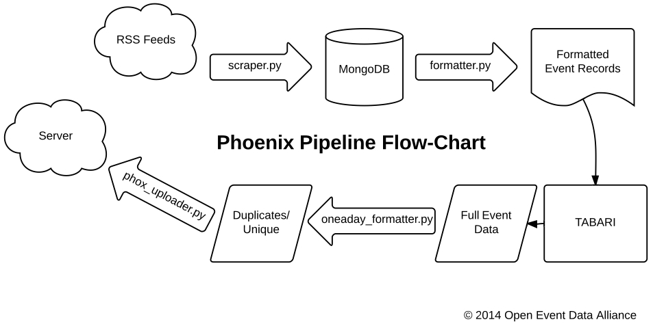

Introduction
============
Turning news into events since 2014.

The Phoenix Pipeline is a system that links a series of Python programs to convert files scrapped from a whitelist of RSS feeds to machine-coded event data. The event data is then uploaded to a server designated in a config file. The system is designed to process a single days worth of information that can be included in multiple text files.

Source code can be found at: https://github.com/openeventdata/phoenix_pipeline

This software is MIT Licensed (MIT)
Copyright (c) 2014 Open Event Data Alliance